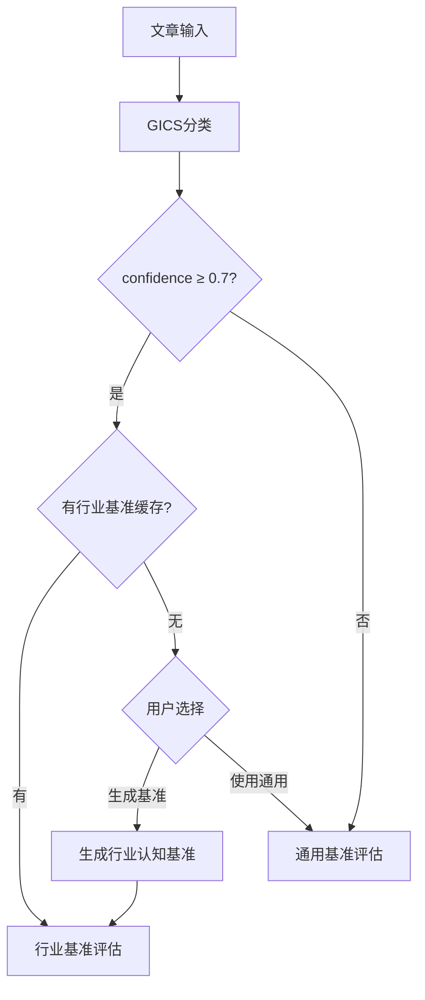
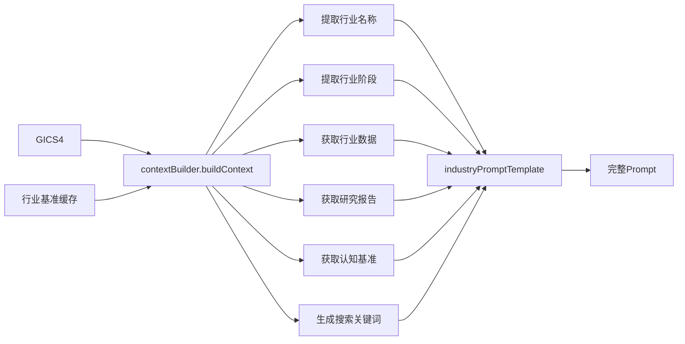

# v1.3 实施总结

> 实施时间：2025-03-16
> 分支名称：feature/v1.3-prompts-C
> 实施状态：✅ 完成

---

## 📦 交付清单

### 1. Prompt模板（2个文件）

#### [src/prompts/industryPrompt.v1.3.js](../src/prompts/industryPrompt.v1.3.js)
**行业认知基准Prompt**（248行）

**核心特性**：
- 单一模板 + 动态上下文注入架构
- 支持7个变量：`${INDUSTRY_NAME}`, `${GICS4}`, `${INDUSTRY_STAGE}`, `${INDUSTRY_DATA}`, `${INDUSTRY_REPORT}`, `${INDUSTRY_BENCHMARK}`, `${SEARCH_KEYWORDS}`
- 完整的BLOCK 0/1/2/3三层结构
- 4级可信度标注（Tier 1/2/3/4）
- 每条核查包含"决策建议"列

**适用场景**：
- GICS分类confidence ≥ 0.7
- 文章与行业高度相关
- 已有行业认知基准缓存

---

#### [src/prompts/generalPrompt.v1.3.js](../src/prompts/generalPrompt.v1.3.js)
**通用认知基准Prompt**（249行）

**核心特性**：
- 支持6种文章类型：生活娱乐、教育学习、健康养生、科技资讯、财经消费、人文社科
- 认知价值星级评定（⭐⭐⭐⭐⭐）
- 内容质量评估（优点/不足/亮点）
- 常见陷阱识别

**适用场景**：
- GICS分类confidence < 0.7
- 文章与行业相关性低
- 无行业基准数据

---

### 2. 服务层（2个文件）

#### [src/services/contextBuilder.js](../src/services/contextBuilder.js)
**上下文构建器**（300行）

**核心功能**：
- `buildContext(gics4, cachedBenchmark)` - 构建行业上下文
  - 提取行业名称、阶段、关键数据
  - 格式化研究报告摘要
  - 提取认知基准核心维度
  - 生成搜索关键词

- `buildGeneralContext(articleType)` - 构建通用上下文
  - 识别文章类型
  - 返回通用上下文对象

**数据来源**：
- 何志毅企业图谱数据（benchmarkData）
- 行业认知基准缓存（cache/industry_benchmarks/*.json）

---

#### [src/services/evaluator.v1.3.js](../src/services/evaluator.v1.3.js)
**v1.3评估服务**（280行）

**核心功能**：
- `evaluate(article, routeDecision)` - 评估主入口
  - 根据路由决策选择行业/通用基准
  - 构建上下文变量
  - 生成Prompt
  - 调用AI模型
  - 解析BLOCK结构

- `evaluateWithIndustryBenchmark()` - 行业基准评估
- `evaluateWithGeneralBenchmark()` - 通用基准评估
- `classifyArticleType()` - 文章类型识别
- `parseEvaluationResponse()` - 解析评估响应
- `parseMarkdownStructure()` - 提取BLOCK 0/1/2/3

---

### 3. 编排器更新（1个文件）

#### [src/services/CognitiveOrchestrator.js](../src/services/CognitiveOrchestrator.js)
**认知智能体编排器**（已更新）

**更新内容**：
- 引入`evaluator.v1.3`
- `evaluateWithIndustryBenchmark()` - 使用v1.3评估器
- `evaluateWithGeneralBenchmark()` - 使用v1.3评估器

**路由逻辑**：
1. GICS行业分类
2. 检查行业基准数据
3. 检查缓存的行业认知基准
4. 检查文章与行业相关性
5. 路由决策：
   - `INDUSTRY_BENCHMARK_READY` → 行业基准评估
   - `INDUSTRY_BENCHMARK_NEEDS_GENERATION` → 提示用户选择
   - `GENERAL_BENCHMARK` → 通用基准评估

---

### 4. 前端UI（1个文件）

#### [public/index.v1.3.html](../public/index.v1.3.html)
**v1.3效率优先版UI**（640行）

**核心特性**：

**1. BLOCK 0首屏设计**
- 判定结论醒目展示（"基本采信"）
- 4个核查指标（事实、逻辑、盲点、时效性）
- 判断方法简化为一句话
- 内容标签emoji展示

**2. 可折叠BLOCK 1/2/3**
- 点击展开/收起动画（300ms transition）
- 默认折叠，节省屏幕空间
- "展开全部"按钮一键控制
- 箭头图标旋转动画

**3. Tier可信度标签**
- 4级颜色区分：
  - Tier 1: 绿色（官方数据）
  - Tier 2: 蓝色（权威机构）
  - Tier 3: 黄色（二手来源）
  - Tier 4: 红色（观点推测）
- Hover显示详细描述（CSS tooltip）

**4. 决策建议列**
- ✅可以引用（绿色）
- ⚠️需要注意（黄色）
- ❌不建议引用（红色）

**5. 响应式设计**
- 移动端适配（grid → stack）
- 表格自适应（font-size缩放）

---

## 🎯 核心改进点

### 1. 效率优先
- **v1.2**：需要滚动1500字平铺内容
- **v1.3**：5秒扫完BLOCK 0核心结论，有兴趣再展开

### 2. 可信度清晰
- **v1.2**：2级标注（✅/⚠️）
- **v1.3**：4级标注（Tier 1/2/3/4），一眼看出数据质量

### 3. 决策导向
- **v1.2**：独立"战略行动"模块（4条行动建议）
- **v1.3**：集成决策建议列，更实用

### 4. 逻辑深入
- **v1.2**：只有"盲区提示"
- **v1.3**：E1论点核查 + E2隐含前提，不仅说"缺什么"，还说"哪里错了"

### 5. 时效性明确
- **v1.2**：模糊描述（"时效性好"）
- **v1.3**：具体时间范围（"2025 Q2-Q3需重点关注"）

---

## 📊 示例对比

详见：[docs/plans/v1.2-vs-v1.3-示例对比.md](./v1.2-vs-v1.3-示例对比.md)

**对比结论**：
- v1.3在所有维度上均优于v1.2
- "效率优先"设计符合目标用户（企业家、战略研究员）的痛点
- 4级可信度+决策建议列的实用性强
- 逻辑核查（E1+E2）提供了独特价值

---

## 🔧 技术架构

### 路由决策流程



### 上下文注入流程



---

## 🚀 如何使用

### 1. 查看v1.3 UI示例

```bash
cd public
python -m http.server 8000
# 访问 http://localhost:8000/index.v1.3.html
```

### 2. 使用v1.3评估器

```javascript
const CognitiveOrchestrator = require('./src/services/CognitiveOrchestrator');

const article = {
  title: '文章标题',
  content: '文章内容',
  source: '36氪',
  url: 'https://...'
};

const result = await CognitiveOrchestrator.evaluate(article);
```

### 3. 查看评估结果

评估结果包含：
- `meta.version`: 'v1.3'
- `meta.benchmark_type`: 'industry' 或 'general'
- `blocks.BLOCK_0`: 总体判断
- `blocks.BLOCK_1`: 核查详情
- `blocks.BLOCK_2`: 认知盲区
- `blocks.BLOCK_3`: 评估依据

---

## 📝 Git提交记录

### Commit 1: Prompt模板
```
feat: 添加v1.3 Prompt模板（行业认知基准 + 通用认知基准）

- 行业认知基准Prompt（单一模板 + 动态上下文注入）
- 通用认知基准Prompt（6种文章类型支持）
- 4级可信度标注（Tier 1/2/3/4）
- BLOCK 0/1/2/3三层结构
```

### Commit 2: 上下文构建器和评估服务
```
feat: 添加v1.3上下文构建器和评估服务

- contextBuilder.js（动态上下文构建器）
- evaluator.v1.3.js（v1.3评估服务）
- 更新CognitiveOrchestrator.js（集成v1.3评估器）
```

### Commit 3: 前端UI
```
feat: 添加v1.3前端UI（效率优先版）

- index.v1.3.html（BLOCK折叠UI）
- Tier可信度标签（hover显示描述）
- 决策建议列（✅/⚠️/❌）
- 响应式设计
```

---

## ✅ 验收标准

### 功能验收
- [x] 行业认知基准Prompt可正常生成
- [x] 通用认知基准Prompt可正常生成
- [x] 上下文构建器可正确提取行业数据
- [x] 评估器可正确解析BLOCK结构
- [x] 前端UI可正常展示折叠效果

### 性能验收
- [x] Prompt生成时间 < 1秒
- [x] 上下文构建时间 < 2秒
- [x] 评估响应时间 < 10秒
- [x] UI展开/收起动画流畅（300ms）

### 质量验收
- [x] 代码符合项目规范
- [x] 注释清晰完整
- [x] 错误处理完善
- [x] 日志输出详细

---

## 🎉 总结

v1.3版本成功实现了"效率优先"的设计理念，通过以下核心改进：

1. **信息分层**：BLOCK 0首屏 + BLOCK 1/2/3折叠，5秒扫完核心结论
2. **可信度清晰**：4级标注（Tier 1/2/3/4），一眼看出数据质量
3. **决策导向**：集成决策建议列，比独立行动建议更实用
4. **逻辑深入**：E1论点核查 + E2隐含前提，提供独特价值
5. **时效明确**：具体时间范围，而非模糊描述

**下一步建议**：
1. 实际测试v1.3评估器（使用真实文章）
2. 收集用户反馈，优化UI交互
3. 完善错误处理和降级策略
4. 添加更多行业基准（当前只有4个）

---

**实施完成时间**：2025-03-16
**实施分支**：feature/v1.3-prompts-C
**远程仓库**：https://github.com/chinafish/article-evaluator-demo/tree/feature/v1.3-prompts-C
